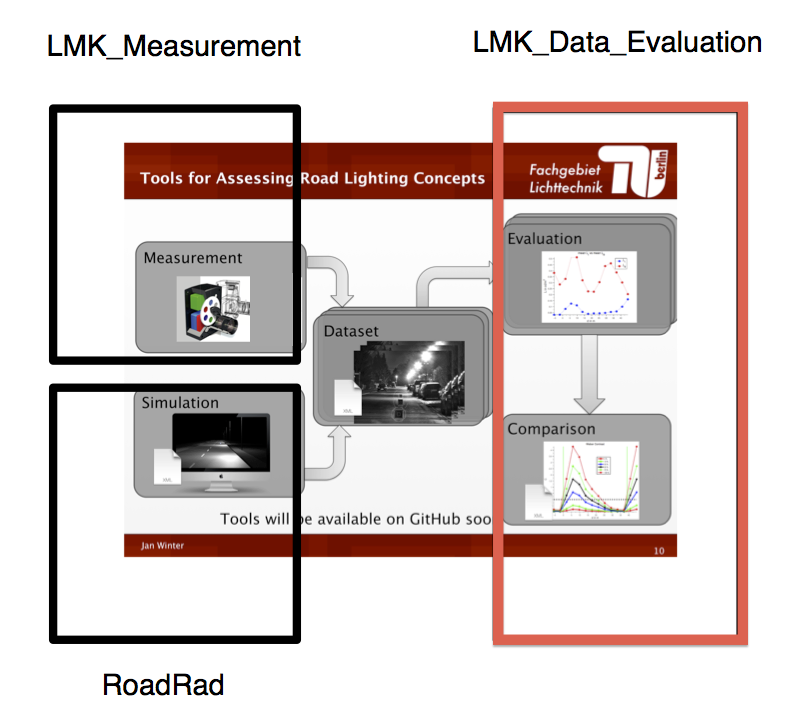
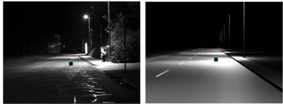
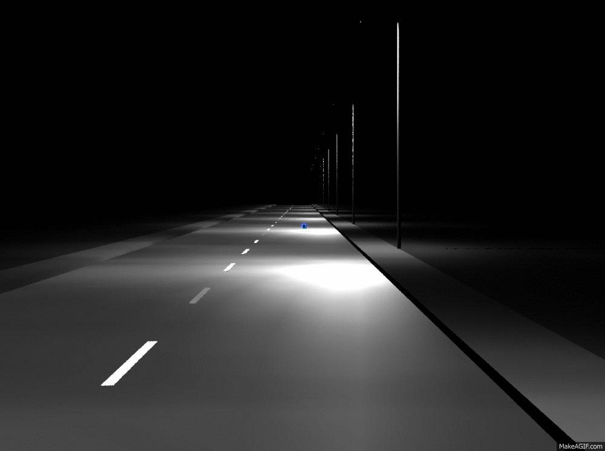
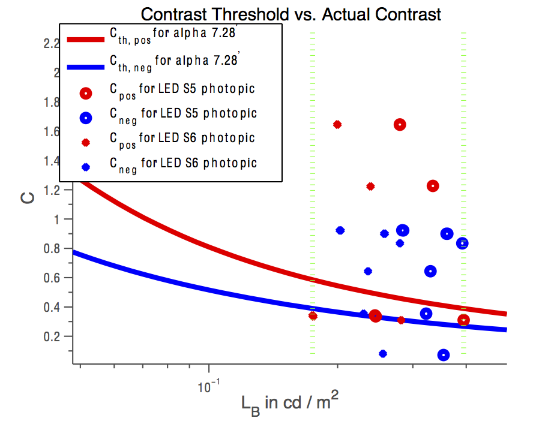

Evaluating Luminance Image Series with MATLAB
=========

## Measurement / Simulation + Evaluation Framework for Road Lighting

This repository is part of a measurement / simulation framework for evaluating contrasts of a small target between two luminaires. It is possible to evaluate the small target visibility level according to ANSI IESNA RP-8-00.

This is the MATLAB based evaluation part:

## Measurement / Simulation

We assume that you have either measured or simulated a luminance image series with our accompanying frameworks:

- [TechnoTeam-LMK-MATLAB](https://github.com/fglichttechnik/TechnoTeam-LMK-MATLAB)
- [Radiance-RoadLighting-Simulation-Framework](https://github.com/fglichttechnik/Radiance-RoadLighting-Simulation-Framework)

## Evaluation

The image series can be evaluated in MATLAB with this framework.

The framework plots both the target and background luminance of a small target:

and plots the contrasts between the luminaires or cumulated vs. the theoretical contrast threshold [Adrian1989]:

## Further Details

For further details have a look into our help file: [Documentation/HowTo_LMK_Data_Evaluation.docx](Documentation/HowTo_LMK_Data_Evaluation.docx).

The accompanying frameworks are:
- Measurement: [TechnoTeam-LMK-MATLAB](https://github.com/fglichttechnik/TechnoTeam-LMK-MATLAB)
- Simulation: [Radiance-RoadLighting-Simulation-Framework](https://github.com/fglichttechnik/Radiance-RoadLighting-Simulation-Framework)
- Evaluation (this framework): [VisibilityLevel-Evaluation-MATLAB](https://github.com/fglichttechnik/VisibilityLevel-Evaluation-MATLAB)

